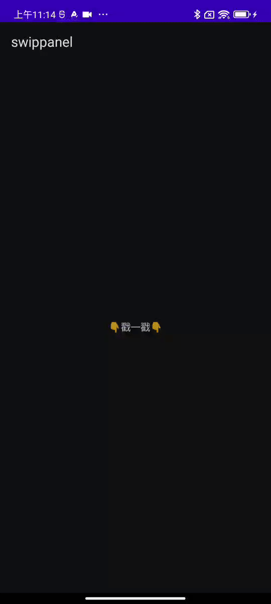

# SwipePanel

**一个易用的且具有良好兼容性的可滑动面板。**

- **易用：**只对外暴露少量接口
- **良好兼容性：**对比Android官方的BottomSheet组件，BottomSheet只兼容单个嵌套滚动场景，对于PagerView嵌套NestedScrollView/RecylcerView的场景无法兼容。

## 功能演示

### show & dismiss panel

dismiss by clicking background



### 多Pager的嵌套滚动


## 使用

1. 定义面板内容： contentView
2. 实例化面板

```kotlin
val swipePanel = SwipePanel(context, contentView)
```

3. 展示隐藏面板

```kotlin
swipePanel.show()
swipePanle.dismiss()
```

## License

```
MIT License

Copyright (c) 2023 heiha100

Permission is hereby granted, free of charge, to any person obtaining a copy
of this software and associated documentation files (the "Software"), to deal
in the Software without restriction, including without limitation the rights
to use, copy, modify, merge, publish, distribute, sublicense, and/or sell
copies of the Software, and to permit persons to whom the Software is
furnished to do so, subject to the following conditions:

The above copyright notice and this permission notice shall be included in all
copies or substantial portions of the Software.

THE SOFTWARE IS PROVIDED "AS IS", WITHOUT WARRANTY OF ANY KIND, EXPRESS OR
IMPLIED, INCLUDING BUT NOT LIMITED TO THE WARRANTIES OF MERCHANTABILITY,
FITNESS FOR A PARTICULAR PURPOSE AND NONINFRINGEMENT. IN NO EVENT SHALL THE
AUTHORS OR COPYRIGHT HOLDERS BE LIABLE FOR ANY CLAIM, DAMAGES OR OTHER
LIABILITY, WHETHER IN AN ACTION OF CONTRACT, TORT OR OTHERWISE, ARISING FROM,
OUT OF OR IN CONNECTION WITH THE SOFTWARE OR THE USE OR OTHER DEALINGS IN THE
SOFTWARE.
```

